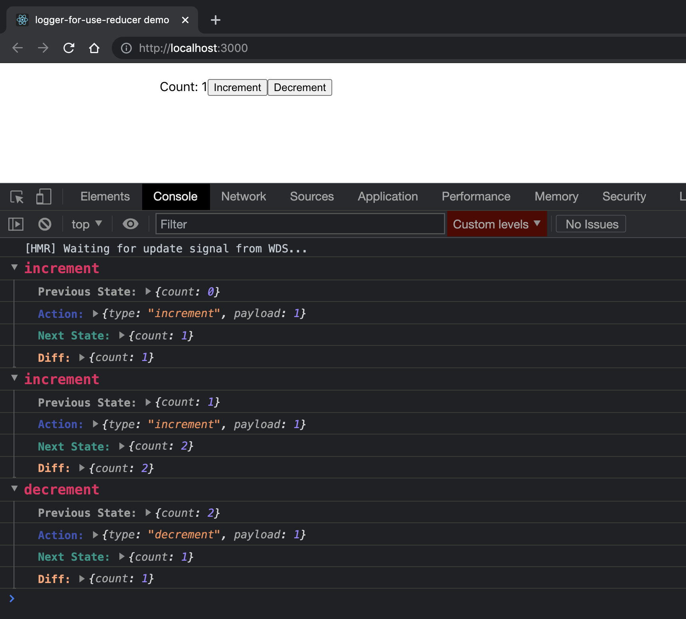

# logger-for-use-reducer

A basic logger for the `useReducer` function in the [React Hooks API](https://reactjs.org/docs/hooks-reference.html#usereducer). This repo is a fork of https://github.com/Zaelot-Inc/use-reducer-logger. Added minor enhancements(provides intellisense, diff between the previous and next state and rewritten in typescript) to the use-reducer-logger package.



# Usage

1. Install with `npm install logger-for-use-reducer`

2. Import logger with

```javascript
import logger from 'logger-for-use-reducer';
```

3. Wrap your reducer with logger before passing it to `useReducer`

```javascript
const [state, dispatch] = useReducer(logger(reducer), initialState);
```

4. Logs are only displayed in the **development environment**. The **logger code will not be executed in the production environment**. If you wish to see logs in production execute the below line in browser console.

```javascript
window.__USE__REDUCER__LOGGER__ = true;
```

See example 👉 [https://stackblitz.com/edit/react-ts-2mjtoj](https://stackblitz.com/edit/react-ts-2mjtoj)

```javascript
import React from 'react';
import logger from 'logger-for-use-reducer';

type ACTIONTYPE =
  | { type: 'increment', payload: number }
  | { type: 'decrement', payload: number };

const initialState = {
  count: 0,
};

function reducer(state: typeof initialState, action: ACTIONTYPE) {
  switch (action.type) {
    case 'increment':
      return { count: state.count + action.payload };
    case 'decrement':
      return { count: state.count - Number(action.payload) };
    default:
      return state;
  }
}

export default function Counter() {
  const [state, dispatch] = React.useReducer(logger(reducer), initialState);

  return (
    <div>
      <span>Count: {state.count}</span>
      <button onClick={() => dispatch({ type: 'increment', payload: 1 })}>
        Increment
      </button>
      <button onClick={() => dispatch({ type: 'decrement', payload: 1 })}>
        Decrement
      </button>
    </div>
  );
}
```

# License

MIT see [`LICENSE`](/LICENSE).

# Contributing

Contributions are welcome.
